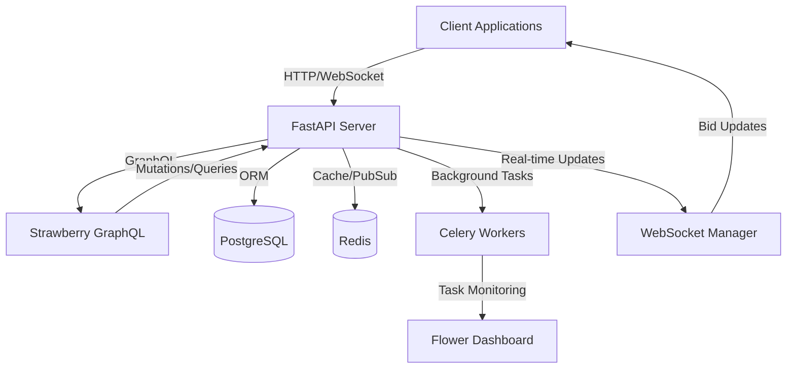

# Auction System

A secure, real-time auction system with race-condition prevention, built with FastAPI, GraphQL, PostgreSQL, Redis, and WebSockets.

## Architecture Overview

## Key Features

- **Secure Bidding**: Atomic operations with Redis locks
- **Real-time Updates**: WebSocket connections for live bid updates
- **Race Condition Prevention**: Optimistic locking and distributed locks
- **Background Processing**: Celery for auction end processing
- **GraphQL API**: Structured queries and mutations
- **Caching**: Redis for session management and caching
- **Monitoring**: Flower dashboard for task monitoring

## Technology Stack

- **FastAPI** - HTTP/WebSocket APIs
- **Strawberry GraphQL** - GraphQL schema and resolvers
- **PostgreSQL** - Relational storage with SQLAlchemy
- **Redis** - Caching, pub/sub, and distributed locks
- **WebSockets** - Real-time bid updates
- **Celery + Flower** - Background task processing
- **Firebase Scheduled Functions** - Periodic checks (coming soon)

## Security Features

- JWT authentication
- Rate limiting
- Input validation
- SQL injection prevention
- XSS protection
- CSRF protection
- Secure WebSocket connections