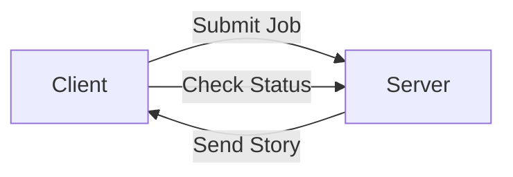

# Story System

A distributed system where clients submit jobs to a server, check their status, and receive generated stories upon completion.

## Architecture Overview

```mermaid
graph LR
    Client-->|Submit Job|Server
    Client-->|Check Status|Server
    Server-->|Send Story|Client
```