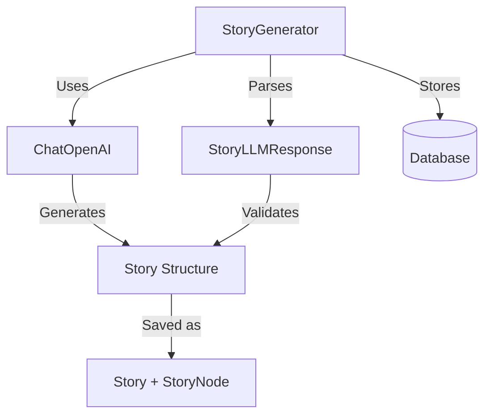

## Architecture Overview

```mermaid
graph TD
    A[StoryGenerator] -->|Uses| B[ChatOpenAI]
    A -->|Parses| C[StoryLLMResponse]
    A -->|Stores| D[(Database)]
    B -->|Generates| E[Story Structure]
    C -->|Validates| E
    E -->|Saved as| F[Story + StoryNode]
```